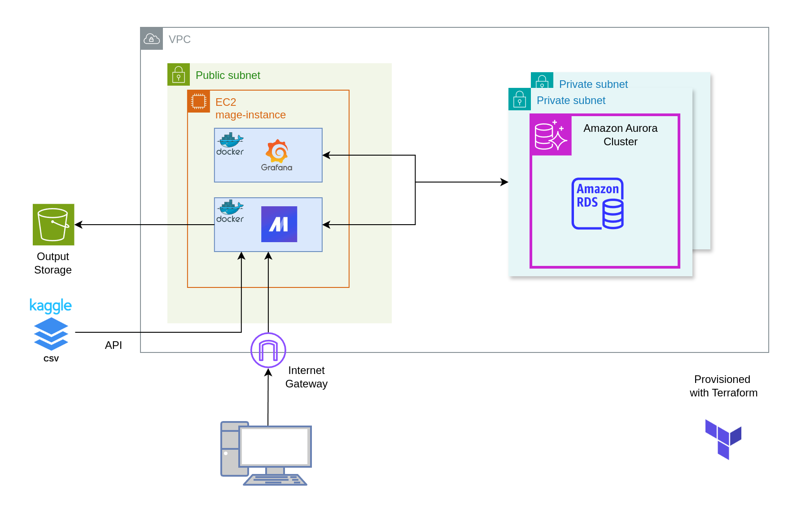
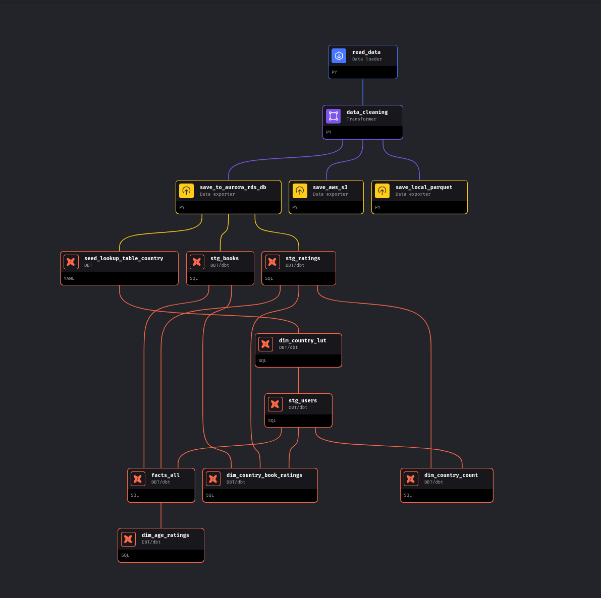
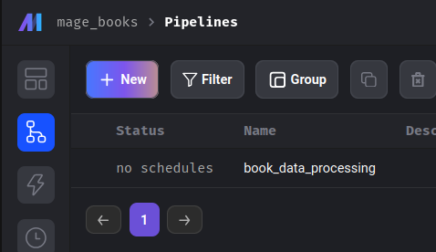
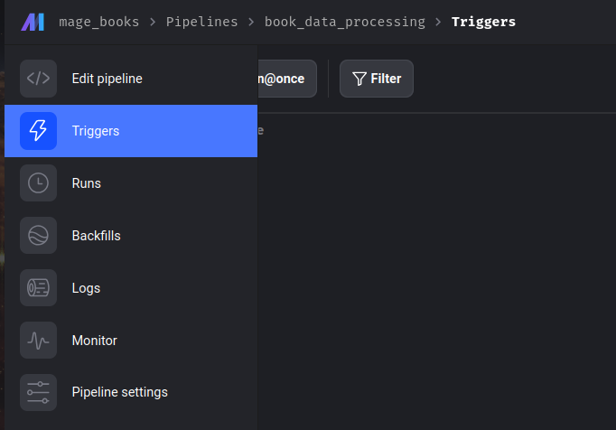
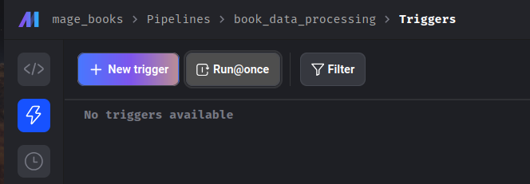
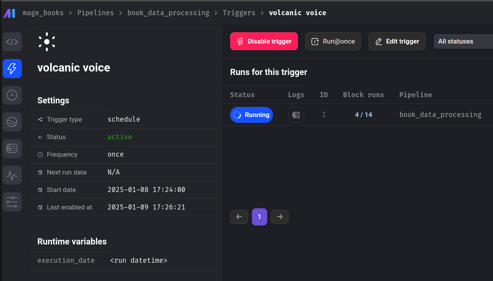
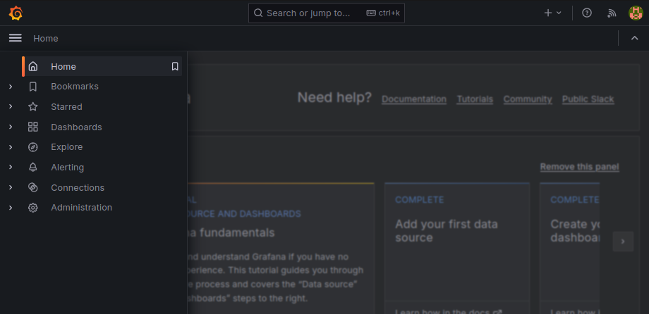
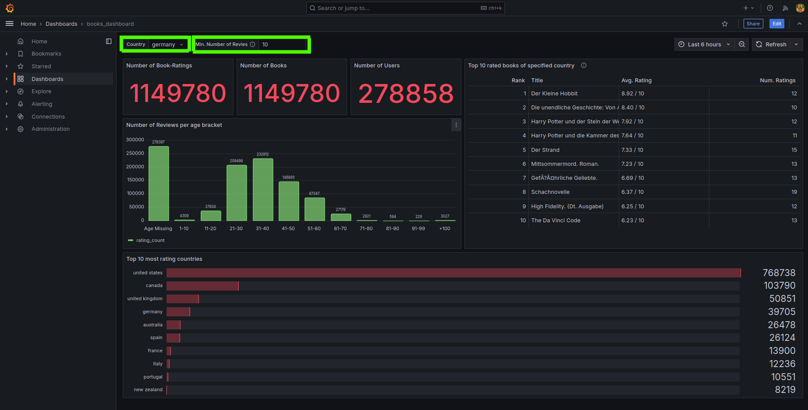

# DE-Project

## About the Project
With this project I wanted to build a fully functioning data-pipeline. I obtained data for book-recommendation from kaggle that contains information about books, ratings for books and the users that rated them. The goal is to obtain and process the data to obtain insights into the data.


The goal of this new version of my Data Engineering project on books data, is to automate the deployment of AWS infrastructure with IaC instead of creating everything manually. For this purpose Terraform is used to create appropriate resources for an ETL pipeline and a database, where data is saved to and read from.


## Used Technology
- `ETL-Pipeline / Workflow orchestration`: [Mage](https://www.mage.ai/)
- `Data Transformation`: [Data Build Tool (dbt)](https://www.getdbt.com/)
- `Visualization`: [Grafana](https://grafana.com/)
- <u><b>Online (AWS)</b></u>
	- `Additional Data-Storage`: [AWS S3](https://aws.amazon.com/s3/)
	- `Compute Resources`: [AWS EC2](https://aws.amazon.com/ec2/)
	- `Database`: [Amazon Aurora Database](https://aws.amazon.com/rds/aurora/)





## AWS user creation

**`Step 0: Create AWS account (optional)`**
- Skip this step if you already have an AWS account
- Otherwise follow the steps here: https://aws.amazon.com/resources/create-account/

**`Step 1: Specify user details`**
- Go to the IAM service in the AWS web-ui & click `Create user`
- Set `User name`
- Check `Provide user access to the AWS Management Console - optional`
- Select `I want to create an IAM user`
- Set a password
  - You can, an should change the password at the next login


**`Step 2: Set permissions`**
Setting the polcy / permissions for the newly created user can be used like below:

- **`Attach policies directly`**: For now attach the `AdministratorAccess` Policy to the IAM user you currently create (can be changed later)
- **`Add user to group`**: If you have a IAM group with the `AdministratorAccess` policy attached to it, you could use it instead of using an inline policy

> The policy attached here is very permissive and will be changed in further commits.


**`Step 3: Review and create`**
- click on the create button

**`Step 4: Retrieve password`**
- Obtain the sign-in details and save them for later

**`Create access keys`**
- Go to IAM and select your newly created IAM user
- Click on `Create access key` button in the `Security Credentials` section of the user
- **Use case**: `Local code`
- Retrieve access keys in next step (download the csv)
- Add them to the credentials in your `.aws` folder
  ```bash
  # Provide IAM User, Access keys, Region and output format
  aws configure --profile <iam-user-name>
  ```

**`Create keypair`**
- Go to `[EC2]` -> `[Key pairs]` -> `[Create key pair]`
- Choose name (e.g. `de_key`)
- Type: `RSA`
- `Private key file format`: pem

## Terraform  


In this section the creation of required infrastructure is done. The Mage pipeline is hosted on a EC2 Instance and the data is stored in a Aurora DB with Postgres engine.

The code used for creating the AWS infrastructure can be found in [terraform](terraform/)-subdirectory.

### Creating the Infrastructure
- Create `tfvars`-file in the terraform-directory
  ```bash
  cd terraform
  touch deployment.tfvars
  ```
  Set the parameters to something like here:
  ```
  # Replace with your values
  region                = "your_region"
  aws-access-key-id     = "your_access_key_id"
  aws-secret-access-key = "your_secret_access_key"
  kaggle-username       = "your_kaggle_username"
  kaggle-key            = "your_kaggle_api_key"
  s3-bucket-name        = "your_unique_bucket_name"

  # Change these if wanted
  project-name          = "mage_books"   
  postgres-dbname       = "dev"
  postgres-schema       = "books_schema"
  postgres-username     = "postgres"
  postgres-password     = "postgres_password123!"
  
  # Should stay the same
  postgres-port         = 5432
  postgres-timeout      = 30
  ```

Go to terraform directory and call the following commands:
```bash
# Go to the terraform directory (if not already there)
cd terraform

# Set the AWS profile to use when creating the infrastructure
# Terraform commands must be done in the same cli-session
aws configure --profile <iam-user-name>

# Make sure to use the correct AWS profile is used by setting the credentials also with env-variables
export AWS_PROFILE=<iam-user-name>
export AWS_ACCESS_KEY_ID=<access-key-id>
export AWS_SECRET_ACCESS_KEY=<secret-key>
export AWS_DEFAULT_REGION=<region>
export AWS_REGION=<region>


# Initialization of terraform resources of provider
terraform init

# check the infrastructure before applying
terraform plan -var-file="deployment.tfvars"

# Apply the infrastructure
terraform apply -var-file="deployment.tfvars"

# (!!!) When destroying the infrastructure use this
terraform destroy -var-file="deployment.tfvars"
```

The commands above will createa VPC with 3 subnets:

- **Public Subnet**:
  - EC2 Instance with 2 Docker container (1x ETL-Pipeline & 1x Grafana Dashboard for Visualization)
- **Private Subnets**:
  - AWS Aurora Serverless database with one instance

After `terraform apply ...` finishes you will have access to both running docker container in the public subnet:
- **Mage ETL-Pipeline**: `<public-ip-of-ec2-instance>:6789`
- **Grafana for Data Visualization**: `<public-ip-of-ec2-instance>:3000`

## Running the Data Engineering Pipeline on the provisioned Infrastructure

### Run the Mage ETL-Pipeline

As mentioned before, you have to open the Orchstration tool Mage at this address `<public-ip-of-ec2-instance>:6789`. All required parameters to run the pipeline have been set during the instantiation of the AWS infrastructure with the [`user_script`](terraform/user_data.sh) and you can directly run the whole process out of the box.

#### Components of the Mage pipeline (with Links)

##### <u>ETL-Part </u> 


- [**`read_data`**](mage_books/data_loaders/read_data.py): 
  - Gets data from Kaggle API and saves them locally to then read them to dataframe
- [**`data_cleaning`**](mage_books/transformers/data_cleaning.py):
  - Transform the obtained data to an appropriate form to be further processed
- [**`save_local_parquet`**](mage_books/data_exporters/save_local_parquet.py):
  - Saving transfrormed data locally in parquet-format
- [**`save_aws_s3`**](mage_books/data_exporters/save_aws_s3.py):
  - Saves transfrormed data in parquet-format to S3 bucket
- [**`save_to_aurora_rds_db`**](mage_books/data_exporters/save_to_aurora_rds_db.py):
  - Saves transfrormed data to *Amazon Aurora Serverless RDS Database*; Creates schemas & tables

##### <u>DBT-Part</u>


- [**`seed_lookup_table_country`**](mage_books/dbt/dbt_books_psql/seeds/country_lut.csv):
  - Seeds the [`country_lut.csv`](mage_books/dbt/dbt_books_psql/seeds/country_lut.csv) lookup-table for dbt with `dbt seed`
- [**`dim_country_lut`**](mage_books/dbt/dbt_books_psql/models/staging/dim_country_lut.sql)
  - Processing countries with country lookup-table to get rid of different namings for same country
- [**`stg_users`**](mage_books/dbt/dbt_books_psql/models/staging/stg_users.sql), [**`stg_books`**](mage_books/dbt/dbt_books_psql/models/staging/stg_books.sql), [**`stg_ratings`**](mage_books/dbt/dbt_books_psql/models/staging/stg_ratings.sql)
  - Create Views from the tables `users`, `books`, `ratings` with dbt staging-models
- [**`dim_country_count`**](mage_books/dbt/dbt_books_psql/models/core/dim_country_count.sql)
  - Obtain table with number of ratings per country
- [**`dim_country_book_ratings`**](mage_books/dbt/dbt_books_psql/models/core/dim_country_book_ratings.sql)
  - Obtain table with average rating of books that were reviewed in a country
- [**`facts_all`**](mage_books/dbt/dbt_books_psql/models/core/facts_all.sql)
  - Creates big table with all three views joined together
- [**`dim_age_ratings`**](mage_books/dbt/dbt_books_psql/models/core/dim_age_ratings.sql)
  - Table that partitions the age of a reviewer in 10 year blocks



#### Executing the pipeline (manually)

Go to the pipeline-section, by clicking the blue box on the left, then click on `book_data_processing` to open the pipeline:



- You will be find yourself in the `Trigger`-View (blue box)
- Click on the `Edit Pipeline` section `</>` to access the code of the pipeline



- To run the pipeline manually you now can execute each block sequentially (in order from top to bottom)
- Each block is executed by clicking the Play button at the top right of a block

#### Executing the pipeline (by triggering pipeline run)
You can run the pipeline by clicking at **`Run@once`**



- This will start a pipeline run which you can now look at by clicking the name of the current run:



- By clicking on the number of `Block runs` you can access the execution status of each block.


> After executing the pipeline you will have a populeted database on your Aurora DB Service


### Grafana Dashboard from DBT data

- Use this address `<public-ip-of-ec2-instance>:3000` (provide your own IPv4 from instance menu) to access the Grafana UI
- Login with user: `admin` and password: `admin` and change the login to your desired user and password



- Go to the dashboard-section on the dropdown-menu seen above
- Click on **`books_dashboard`** and you will see the dashboard



- **`The green boxes`** indicate 2 variables that can be set for filtering results
  - `Country`: select a country from the country list
  - `Min. Number of Reviews`: Threshold for number of reviews to consider to get the top 10 books for a country
    - Some countries in the dataset have not reviwed that many books, which requires the threshold to be lowered somethimes


## `Important`: Dont forget to destroy the provisioned infrastructure!

```bash
cd terraform
terraform destroy -var-file="deployment.tfvars"
```
If there are some hickups during the destroy-process it is most likely due to the S3 bucket still having objects in it. Just delete the objects over the AWS Console and restart the destroy-process. The process will now go through.