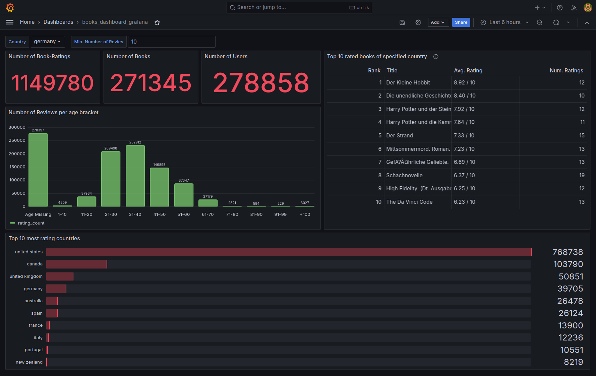

# DE-Project


## About the Project
With this project I wanted to build a fully functioning data-pipeline. I obtained data for book-recommendation from kaggle that contains information about books, ratings for books and the users that rated them. The goal is to obtain and process the data to obtain insights into the data.


## Used Technology
- `ETL-Pipeline / Workflow orchestration`: [Mage](https://www.mage.ai/)
- `Data Transformation`: [dbt](https://www.getdbt.com/)
- `Visualization & BI`: [Grafana](https://grafana.com/)
- <u><b>Online (AWS)</b></u>
	- `Data Lake`: [AWS S3](https://aws.amazon.com/s3/)
	- `Data Warehouse`: [AWS Redshift Serverless](https://aws.amazon.com/redshift/redshift-serverless/)
- <u><b>Offline</b></u>
  - `Local Database`: [PostgreSQL](https://www.postgresql.org/)
  - `DB-Client`: [pgAdmin](https://www.pgadmin.org/)

## Overview


## Requirements & Prerequisites
In this sections different steps are gone throught that are required to run the application. To pass required information to the respective docker-container, parameter in the [`dev.env`](./dev.env) have to be provided. **AFTER** filling out all parameterers, the name has to changed to `.env`:
```bash
cp dev.env .env
```

### Creation of AWS IAM account & attaching Policies
In this section the AWS IAM account is set up. The access key and secret access key are obtained and the user is assigned appropriate policies. This is to access the required AWS resources later on.

#### Create IAM account (on AWS root account)

**`Step 1: Specify user details`**   
 - Set `User name` and insert it here [AWS_PROFILE=...](dev.env#L3)
 - Check `Provide user access to the AWS Management Console - optional`
 - Set password


**`Step 2: set permissions`**

Choose `Attach policies directly` and add the following AWS managed policies and the two inline policies to the IAM account

<details>
<summary><b>AWS managed</b></summary>
<ul>
    <li><i>AmazonEC2FullAccess</i></li>
    <li><i>AmazonRedshiftAllCommandsFullAccess</i></li>
    <li><i>AmazonRedshiftFullAccess</i></li>
    <li><i>AmazonRedshiftQueryEditorV2FullAccess</i></li>
    <li><i>AmazonRedshiftQueryEditorV2ReadSharing</i></li>
    <li><i>AmazonS3FullAccess</i></li>
    <li><i>AmazonVPCFullAccess</i></li>
    <li><i>AWSGlueServiceRole</i></li>
    <li><i>IAMFullAccess</i></li>
</ul>    
</details>

<details><summary><b>AllowReadingMetricsFromRedshift</b></summary>

```json
{
    "Version": "2012-10-17",
    "Statement": [
        {
            "Sid": "AllowReadingMetricsFromRedshift",
            "Effect": "Allow",
            "Action": [
                "redshift-data:ListTables",
                "redshift-data:DescribeTable",
                "redshift-data:GetStatementResult",
                "redshift-data:DescribeStatement",
                "redshift-data:ListStatements",
                "redshift-data:ListSchemas",
                "redshift-data:ExecuteStatement",
                "redshift-data:CancelStatement",
                "redshift:GetClusterCredentials",
                "redshift:DescribeClusters",
                "redshift-serverless:ListWorkgroups",
                "redshift-serverless:GetCredentials",
                "secretsmanager:ListSecrets"
            ],
            "Resource": "*"
        },
        {
            "Sid": "AllowReadingRedshiftQuerySecrets",
            "Effect": "Allow",
            "Action": [
                "secretsmanager:GetSecretValue"
            ],
            "Resource": "*",
            "Condition": {
                "Null": {
                    "secretsmanager:ResourceTag/RedshiftQueryOwner": "false"
                }
            }
        }
    ]
}
```
</details>

<details><summary><b>EC2InstanceConnect</b></summary>

```json
{
    "Version": "2012-10-17",
    "Statement": [
        {
            "Effect": "Allow",
            "Action": [
                "ec2-instance-connect:SendSSHPublicKey",
                "ec2:DescribeInstances"
            ],
            "Resource": "*"
        }
    ]
}
```

</details>

**`Step 3: Review and create`**
- click on the create button

**`Step 4: Retrieve password`**
- Obtain the sign-in details and save them for later

**`Create access keys`**
- Go to IAM 
- **Use case**: Local code
- Retrieve access keys in next step (download the csv)
- Now insert the access keys and region and username into `dev.env`:
  - [AWS_PROFILE=...](./dev.env#L3)
  - [AWS_ACCESS_KEY_ID=...](./dev.env#L4)
  - [AWS_SECRET_ACCESS_KEY=...](./dev.env#L5)
  - [AWS_REGION=...](./dev.env#L6)


### Obtaining Kaggle API-credentials
- Data-source: [here](https://www.kaggle.com/datasets/arashnic/book-recommendation-dataset/)
- Create kaggle API-credentials and download them, then save them to `.kaggle/kaggle.json`

### Creating AWS resources
- **S3-Bucket:** 
  - Create a `General purpose` bucket with default settings and specify the name after [`S3_BUCKET_NAME=...`](./dev.env#L9) 

- **AWS Redshift Serverless**
  - [Example video](https://www.youtube.com/watch?v=Kd9_60NC2mY) for creating AWS Redshift Serverless resources
  - Open AWS Redshift in the application menu
  - Click on `Try Redshift Serverless free trial`
  - Choose either default settings (default-namespace) or choose a different name with Custom settings
  - **Permissions**: Crete the proposed IAM role and associate it with Redshift s.t. it has access to the prev. created S3 bucket
  - Conclude the process by clicking `Save configuration`
  - Ceation of namespace also created a workspace
  - Now click on query data and then click on the serverless dropdown menu on the left. Choose `Federated user`
  - You should now be able to use the serverless version of AWS Redshift.
  
Three parameter of Redshift are fixed here:
```bash
# Redshift
REDSHIFT_SCHEMA=books_schema
REDSHIFT_DBNAME=dev
REDSHIFT_PORT=5439
```
The other three parameters have to be set with Redshift running
- [REDSHIFT_WGNAME=...](./dev.env#L26)
  - Name of workgroup
- [REDSHIFT_HOST=...](./dev.env#L27)
  - Endpoint URL of workgroup
- [REDSHIFT_IAM_PROFILE=...](./dev.env#L28)
  - ARN of IAM role for AWS Redshift. Can be found in Security and Encryption section of the workspace information

### Starting docker compose to access the configured resources
Now the parmeters of [dev.env](dev.env) should be completely filled out and you can rename `dev.env` to `.env` and start all the containers with docker compose
```bash
docker compose up
# If you staring the docker compose the first time use `--build`
docker compose up --build
```

### Login to PgAdmin and accessing tables
- Open [http://localhost:5050](http://localhost:5050/) in the browser
- See [PGADMIN_DEFAULT_EMAIL](docker-compose.yml#L43) and [PGADMIN_DEFAULT_PASSWORD](docker-compose.yml#L44) for login information
- You are now logged in to pgadmin

#### Create and connect server to postgres database where results of the pipeline are stored
- Right-click on server in object explorer, then `[Register]`, then `[Server...]`
- Provide an appropriate `Name`, then go to connections and use the parmaeters following the line [here](dev.env#L11)
  - `Host name/address`: postgres (docker-compose address)
  - `Port`: 5432
  - `Username`: Given here [POSTGRES_USER](dev.env#L15)
  - `Password`: Given here [POSTGRES_PASSWORD](dev.env#L16)


### Login to Grafana and data source configuration
- Open [http://localhost:3000](http://localhost:3000)
- Provide the default password `admin`. You can then change the password if you want or use `admin` by providing it again
- Connection to the Postgres-Datasource is already established/pre-configured (nothing to do here)
- Establish connection to the Redshift-Datasource
  - Go to [Data sources](http://localhost:3000/connections/datasources) and add new data source
  - Search for Redshift and select it
  - Name must stay `grafana-redshift-datasource` for dashboard to work
  - Choose for Authentication `Access & secret key` and insert them
  - Leave everey field blank until the `Default Region`, which has to be set according to the region your Redshift-Datasource is in
  - In Redshift Details
    - Choose *Temporary credentials*
    - Tick the *Serverless* slider
    - Select the workgroup you use in the *Workgroup* form
    - Select the database in your Redshift datasource where all results are stored (Redshift-default is dev)
    - Click save and test. You should get a `Data source is working`-message
  - Go to `Data sources` and select `grafana-redshift-datasource`
  - Look at the url and extract the `uid` of the data source: `http://localhost:3000/connections/datasources/edit/<uid>`
  - Update the template of the redshift-dashboard with:
    ```bash
    python3 set_grafana_rs_uid.py <uid>
    ```
  - The dashboard is now configured and is waiting for data

## Run Mage Pipeline
In the image below you can see the FULL Mage pipeline with all branches and then the 2 main branches seperate besides each other


- This pipeline gets the data, processes it and saves it to Redshift or local Postgres databas (Part 1), then the dbt (Part 2) is used to process the data and make it usable in a dashboard

<p float="left">
  
  
</p>

- Open the Mage container with [http://localhost:6789/](http://localhost:6789/) and select the pipelines on the left side-bar, then open [`book_data_processing`](http://localhost:6789/pipelines/book_data_processing/edit?sideview=tree)


> **`VERY IMPORTANT`**: There are 2 dbt projects:
> - `dbt_books` (AWS Redshift) 
> - `dbt_books_psql` (Local postgres)
> 
> Both require some information about the data-source to work. To specify which branch (`dbt_books` with `aws` or `local` with `dbt_books_psql`) a global variable **`dbt_mode`** has to be specified as seen below:


The 2 projects:


- **dbt_books_psql** (dbt on local Postgres database)
  - This runs dbt locally and uses the postgresql database located in the container specified under `postgres` in [docker-compose.yml](docker-compose.yml#L26)
  - The [`profiles.yml`](./mage_books/dbt/dbt_books_psql/profiles.yml)-parameter of the project are interpolated from the environment-variables defined in [`.env`](.env)
    ```yml
    dbt_books_psql:
      outputs:
        dev:
          dbname: {{ env_var('POSTGRES_DBNAME') }}
          host: {{ env_var('POSTGRES_HOST') }}
          pass: {{ env_var('POSTGRES_PASSWORD') }}
          port: {{ env_var('POSTGRES_PORT') }}
          schema: {{ env_var('POSTGRES_SCHEMA') }}
          threads: 2
          type: postgres
          user: {{ env_var('POSTGRES_USER') }}
      target: dev
    ```
  - **Run the project**:
    ```bash
    # Open the console (right side-bar second lowest icon [>_])
    # Navigate to the project
    cd mage_books/dbt/dbt_books_psql/
    # Test if connection is established
    dbt debug
    ```
    - Set the `dbt_mode` global variable to `local`
    - Go to the pipelines [triggers](http://localhost:6789/pipelines/book_data_processing/triggers/) and click `[Run@once]` 
    - The tables should now be available in the configured postgres-database and visible in the pgadmin-container at [http://localhost:5050](http://localhost:5050/)

- **dbt_books** (dbt on Redshift)
  - This runs dbt on Redshift and requires some configuration
  - The [`profiles.yml`](./mage_books/dbt/dbt_books/profiles.yml) parameter of the project are interpolated from the environment-variables defined in [`.env`](.env)
    ```yml
    dbt_books:
      outputs:
        dev:
          dbname: {{ env_var('REDSHIFT_DBNAME') }}
          host: {{ env_var('REDSHIFT_HOST') }}
          method: iam
          port: {{ env_var('REDSHIFT_PORT') }}
          schema: {{ env_var('REDSHIFT_SCHEMA') }}
          threads: 2
          type: redshift
          user: admin
      target: dev
      ```
    - **Run the project**:
    ```bash
    ## Console Version
    # Open the console (right side-bar second lowest icon [>_])
    # Navigate to the project
    cd mage_books/dbt/dbt_books/
    # Test if connection is established
    dbt debug
    ```
    - Set the `dbt_mode` global variable to `aws`
    - Go to the pipelines [triggers](http://localhost:6789/pipelines/book_data_processing/triggers/) and click `[Run@once]` 
    - **(Optional) Running isolated blocks instead of all**:
      - Run the blocks by clicking on the play-button at top of each block (please make sure to have all input tables for a block created before executing it)


### Running the Mage Pipeline (Now for real!!)
If everything is set up correctly configured in [`.env`](./.env), lets look at this checklist and see if everything is correctly in place:
- `S3`: exists an is configured
- `Redshift`: exists an is configured
- `kaggle`: downloaded and correctly placed
- `dbt`: configured as seen above and tested with `dbt debug` (the `dbt_books`-project)

> ***`Important`***: Redshift usage can sometimes become relatively expensive, so please try out manual execution first, especially for the dbt-blocks. Then check if `stg_books_rs` works by clicking on the `Compile & preview` button at the top of the block

#### You should now be able to run the entire pipeline
**You can either run each sequential block seperately by** ...
- Using the play-button at the top of each block
- Right clicking on a block in the Tree-view and selecting `Run block`

**Running the entire pipeline by triggering a pipeline-run**
- Go to the trigger section (lightning icon on the left side-bar) or click [here](http://localhost:6789/pipelines/book_data_processing/triggers).
- Click on `Manuel Trigger` and click on **Run@once**-button to start the entire pipeline


After completion of the pipeline you can see the following contents in the specified database of your Redshift workgroup:


## Grafana for Data Insight and BI
- Open Grafana in browser: http://localhost:3000/

To visualize data, that was extracted from the dbt-pipeline the monitoring software `Grafana` is used, which is also applicable in the use-case of Business Intelligence (BI). A Grafana container is created when starting [`docker compose`](docker-compose.yml#L50) and is already connected to the [dockerized Postgres database](docker-compose.yml#L26). After running the local dbt-project `dbt_books_psql` you should be able to see the `books_dashboard_grafana`-dashboard, and after running the pipeline (block by block sequentially or whole pipeline) you should see the dashboard that accesses AWS Redshift instead of the local database.


### Grafana Dashboard with data from Postgres database


### Grafana Dashboard with data from AWS Redsift Serverless database


-------------------------------------